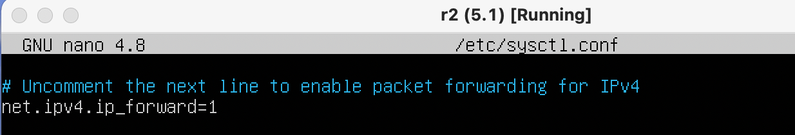
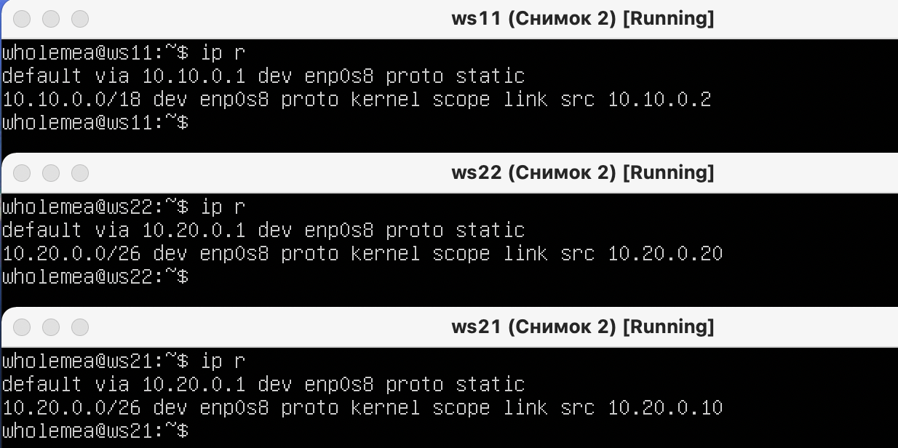
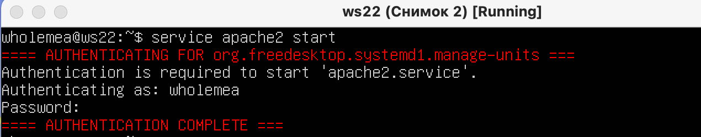

## Part 1. Инструмент ipcalc

### 1.1. Сети и маски.
1) адрес сети 192.167.38.54/13


2)  
- Перевод маски 255.255.255.0 в префиксную и двоичную запись

``` 
ipcalc 255.255.255.0 
``` 


- /15 в обычную и двоичную
``` 
ipcalc 255.255.255.0/15
``` 


- 11111111.11111111.11111111.11110000 в обычную и префиксную
адрес маски в двоичном виде, перевел в десятичный вид с помощью онлайн калькулятора масок
``` 
ipcalc 192.167.38.54/255.255.255.240
``` 


3) минимальный и максимальный хост в сети 12.167.38.4 при масках:
- /8
``` 
ipcalc 12.167.38.4/8
```

- 11111111.11111111.00000000.00000000
``` 
ipcalc 12.167.38.4/255.255.0.0
```

- 255.255.254.0
``` 
ipcalc 12.167.38.4/255.255.254.0
```

- /4
``` 
ipcalc 12.167.38.4/4
```


### 1.2. localhost.

Определить и записать в отчёт, можно ли обратиться к приложению, работающему на localhost, со следующими IP:

Подключенеие невозможно, если отсутствует loopback.

Следовательно:

- 194.34.23.100 - нельзя
``` 
ipcalc 194.34.23.100
```

- 127.0.0.2 - можно
``` 
ipcalc 127.0.0.2
```

- 127.1.0.1 - можно
``` 
ipcalc 127.1.0.1
```

- 128.0.0.1 - нельзя
``` 
ipcalc 128.0.0.1
```


### 1.3. Диапазоны и сегменты сетей.

1.3. Диапазоны и сегменты сетей

1) какие из перечисленных IP можно использовать в качестве публичного, а какие только в качестве частных:
- 10.0.0.45 - частный
``` 
ipcalc 10.0.0.45
```

- 134.43.0.2 - публичный
``` 
ipcalc 134.43.0.2
```

- 192.168.4.2 - частный
``` 
ipcalc 192.168.4.2
```

- 172.20.250.4 - частный
``` 
ipcalc 172.20.250.4
```

- 172.0.2.1 - публичный
``` 
ipcalc 172.0.2.1
```

- 192.172.0.1 - публичный
``` 
ipcalc 192.172.0.1
```

- 172.68.0.2 - публичный
``` 
ipcalc 172.68.0.2
```

- 172.16.255.255 - частный
``` 
ipcalc 172.16.255.255
```

- 10.10.10.10 - частный
``` 
ipcalc 10.10.10.10
```

- 192.169.168.1 - публичный
``` 
ipcalc 192.169.168.1
```


2) какие из перечисленных IP адресов шлюза возможны у сети 10.10.0.0/18:

Исходя из min и max хостов сети 10.10.0.0/18:


- 10.0.0.1 - не возможен
- 10.10.0.2 - возможен
- 10.10.10.10 - возможен
- 10.10.100.1 - не возможен
- 10.10.1.255 - возможен


## Part 2. Статическая маршрутизация между двумя машинами

С помощью команды ```ip a```  посмотреть существующие сетевые интерфейсы

- ws1


- ws2


Описать сетевой интерфейс, соответствующий внутренней сети, на обеих машинах и задать следующие адреса и маски: ws1 - 192.168.100.10, маска /16, ws2 - 172.24.116.8, маска /12

- ws1


- ws2


Выполнить команду netplan apply для перезапуска сервиса сети

- ws1


- ws2


### 2.1. Добавление статического маршрута вручную.

Добавить статический маршрут от одной машины до другой и обратно при помощи команды вида ip r add

*  ws1  
```
ip r add 172.24.116.8 via 192.168.100.10 dev enp0s8
```

  

* Вводим на машине ws2 команду 
```
ip r add 192.168.100.10 via 172.24.116.8 dev enp0s8
```


Пропинговать соединение между машинами

- ws1 - успешно


- ws2 - успешно


### 2.2. Добавление статического маршрута с сохранением.

Перезапустить машины

Добавить статический маршрут от одной машины до другой с помощью файла etc/netplan/00-installer-config.yaml

- ws1


- ws2


Пропинговать соединение между машинами

- ws1 - успешно


- ws2 - успешно


## Part 3. Утилита iperf3
### 3.1. Скорость соединения.

Перевести и записать в отчёт: 8 Mbps в MB/s, 100 MB/s в Kbps, 1 Gbps в Mbps

- 8 Mbps = 1 MB/s 
- 100 MB/s = 819200 Kbps
- 1 Gbps = 1024 Mbps

### 3.2. Утилита iperf3.

Измерить скорость соединения между ws1 и ws2.

В данном случае в роли сервера будет выступать ws1, а ws2 в роли клиента.
- ws1
```
iperf3 -s
```
- ws2
```
iperf3 -c 192.168.100.10
```
Результат:
- ws1


- ws2


## Part 4. Сетевой экран
### 4.1. Утилита iptables.

Создать файл /etc/firewall.sh, имитирующий фаерволл, на ws1 и ws2.

Нужно добавить в файл подряд следующие правила:

1) на ws1 применить стратегию когда в начале пишется запрещающее правило, а в конце пишется разрешающее правило (это касается пунктов 4 и 5)

2) на ws2 применить стратегию когда в начале пишется разрешающее правило, а в конце пишется запрещающее правило (это касается пунктов 4 и 5)

3) открыть на машинах доступ для порта 22 (ssh) и порта 80 (http)

4) запретить echo reply (машина не должна "пинговаться”, т.е. должна быть блокировка на OUTPUT)

5) разрешить echo reply (машина должна "пинговаться")

- ws1


- ws2


Запустить файлы на обеих машинах командами chmod +x /etc/firewall.sh и /etc/firewall.sh

- ws1


- ws2

```
Так как утилита iptabels выполняет первое прочитанное правило, 
разница между стратегиями заключается в порядке команд. 
- Для машины ws1 первой стоит команда REJECT - отклонить пакет. 
Будет выполнятся этот запрет и пинг не пройдет. 
- Для машины ws2 напротив, первым стоит ACCEPT - разрешить 
прохождение пакета. Пинг проходит.
```

<!-- https://serverspace.ru/support/help/nastroika-firewall-iptables-na-linux/ -->
### 4.2. Утилита nmap.

Командой ping найти машину, которая не "пингуется", после чего утилитой nmap показать, что хост машины запущен
Проверка: в выводе nmap должно быть сказано: Host is up

- ws1 -  пингуется))


- ws2 - не пингуется((


## Part 5. Статическая маршрутизация сети
### 5.1. Настройка адресов машин.
Настроить конфигурации машин в etc/netplan/00-installer-config.yaml согласно сети на рисунке.


Рабочие станции:

- ws11


- ws22


- ws21


Роутеры:

- r1


- r2


Перезапустить сервис сети. Если ошибок нет, то командой ip -4 a проверить, что адрес машины задан верно. 


Также пропинговать ws22 с ws21.


Аналогично пропинговать r1 с ws11.


### 5.2. Включение переадресации IP-адресов.

Для включения переадресации IP, выполните команду на роутерах:
```
sysctl -w net.ipv4.ip_forward=1
```
При таком подходе переадресация не будет работать после перезагрузки системы.

- r1


- r2


Откройте файл /etc/sysctl.conf и добавьте в него следующую строку:
```
net.ipv4.ip_forward = 1
```
При использовании этого подхода, IP-переадресация включена на постоянной основе.

- r1


- r2


### 5.3. Установка маршрута по-умолчанию. 

Настроить маршрут по-умолчанию (шлюз) для рабочих станций. Для этого добавить default перед IP роутера в файле конфигураций:

- ws11


- ws22


- ws21


Вызвать ip r и показать, что добавился маршрут в таблицу маршрутизации


Пропинговать с ws11 роутер r2 и показать на r2, что пинг доходит. Для этого использовать команду:
```
tcpdump -tn -i eth1
```

Задаём шлюзы для роутеров, чтобы иметь доступ в соседнюю подсеть

- r1


- r2


- ws11 - пингуется))0)


- r2 - пинг доходит


### 5.4. Добавление статических маршрутов.

Добавить в роутеры r1 и r2 статические маршруты в файле конфигураций.

- r1


- r2


Вызвать `ip r` и показать таблицы с маршрутами на обоих роутерах.

- r1


- r2


Запустить команды на ws11:
```
ip r list 10.10.0.0/[маска сети]
ip r list 0.0.0.0/0
```

- ws11


Для адреса `10.10.0.0/18` был выбран маршрут, отличный от `0.0.0.0/0`, так как маршрут по-умолчанию имеет более низкий приоритет, чем маршрут, указанный в таблице маршрутизации. Поскольку для сети `10.10.0.0` нами было создано правило, созданный маршрут был использован.

### 5.5. Построение списка маршрутизаторов.

При помощи утилиты traceroute построить список маршрутизаторов на пути от ws11 до ws21

- ws11


- r1

Для определения промежуточных маршрутизаторов traceroute отправляет целевому узлу серию ICMP-пакетов (по умолчанию 3 пакета), с каждым шагом увеличивая значение поля TTL («время жизни») на 1. Это поле обычно указывает максимальное количество маршрутизаторов, которое может быть пройдено пакетом. Первая серия пакетов отправляется с TTL, равным 1, и поэтому первый же маршрутизатор возвращает обратно ICMP-сообщение «time exceeded in transit», указывающее на невозможность доставки данных. Traceroute фиксирует адрес маршрутизатора, а также время между отправкой пакета и получением ответа (эти сведения выводятся на монитор компьютера). Затем traceroute повторяет отправку серии пакетов, но уже с TTL, равным 2, что заставляет первый маршрутизатор уменьшить TTL пакетов на единицу и направить их ко второму маршрутизатору. Второй маршрутизатор, получив пакеты с TTL=1, так же возвращает «time exceeded in transit».

### 5.6. Использование протокола ICMP при маршрутизации.

Запустить на r1 перехват сетевого трафика, проходящего через eth0 с помощью команды:
```
tcpdump -n -i eth0 icmp
```

Пропинговать с ws11 несуществующий IP (например, 10.30.0.111) с помощью команды:
```
ping -c 1 10.30.0.111
```
- ws11


- r1


## Part 6. Динамическая настройка IP с помощью DHCP

Для r2 настроить в файле /etc/dhcp/dhcpd.conf конфигурацию службы DHCP:

1) указать адрес маршрутизатора по-умолчанию, DNS-сервер и адрес внутренней сети.

- r2


2) в файле resolv.conf прописать nameserver 8.8.8.8.

- r2


Перезагрузить службу DHCP командой systemctl restart isc-dhcp-server. Машину ws21 перезагрузить при помощи reboot и через ip a показать, что она получила адрес.

- r2


- ws21


Также пропинговать ws22 с ws21.

- ws21


Указать MAC адрес у ws11, для этого в etc/netplan/00-installer-config.yaml надо добавить строки: macaddress: 10:10:10:10:10:BA, dhcp4: true

- ws11


Для r1 настроить аналогично r2, но сделать выдачу адресов с жесткой привязкой к MAC-адресу (ws11). Провести аналогичные тесты


Bносим изменения в файл /etc/dhcp/dhcpd.conf
- r1


Измененный файл /etc/resolv.conf на r1:
- r1


Перезагрузить службу DHCP командой systemctl restart isc-dhcp-server. Машину ws11 перезагрузить при помощи reboot и через ip a показать, что она получила адрес.

Перезагружаем службу DHCP командой systemctl restart isc-dhcp-server
- r1


- ws11  - ip a


- ws11 - пингуется))0) с ws22

- Запросить с ws21 обновление ip адреса

    ws21 IP адрес до обновления (10.20.0.2)

    

    Теперь для обновления ip адреса нужно:

    "sudo dhclient -r" для освобождения адреса
    "sudo dhclient" для запроса адреса

    ws21 IP адрес после обновления (10.20.0.4)

    

## Part 7. NAT

В файле /etc/apache2/ports.conf на ws22 и r1 изменить строку Listen 80 на Listen 0.0.0.0:80, то есть сделать сервер Apache2 общедоступным

- ws22


- r1


Запустить веб-сервер Apache командой service apache2 start на ws22 и r1

- ws22


- r1


Добавить в фаервол, созданный по аналогии с фаерволом из Части 4, на r2 следующие правила:

1) удаление правил в таблице filter - iptables -F


2) удаление правил в таблице "NAT" - iptables -F -t nat


3) отбрасывать все маршрутизируемые пакеты - iptables --policy FORWARD DROP

- r2


Запускаем его аналогично Part 4: 
```
sudo chmod -x /etc/firewall.sh
```
```
sudo bash /etc/firewall.sh
```

Проверить соединение между ws22 и r1 командой ping

При запуске файла с этими правилами, ws22 не должна "пинговаться" с r1

- w22


Добавить в файл ещё одно правило:

4) разрешить маршрутизацию всех пакетов протокола ICMP

Для этого нужно добавить две строчки в наш firewall.sh

- w22


Запускаем его аналогично Part 4: 
```
sudo chmod -x /etc/firewall.sh
```
```
sudo bash /etc/firewall.sh
```


Проверить соединение между ws22 и r1 командой ping

При запуске файла с этими правилами, ws22 должна "пинговаться" с r1

- r1


Добавить в файл ещё два правила:

5) включить SNAT, а именно маскирование всех локальных ip из локальной сети, находящейся за r2 (по обозначениям из Части 5 - сеть 10.20.0.0)
Совет: стоит подумать о маршрутизации внутренних пакетов, а также внешних пакетов с установленным соединением

6) включить DNAT на 8080 порт машины r2 и добавить к веб-серверу Apache, запущенному на ws22, доступ извне сети
Совет: стоит учесть, что при попытке подключения возникнет новое tcp-соединение, предназначенное ws22 и 80 порту

- w22


Запускать файл также, как в Части 4
Перед тестированием рекомендуется отключить сетевой интерфейс NAT (его наличие можно проверить командой ip a) в VirtualBox, если он включен

Проверить соединение по TCP для SNAT, для этого с ws22 подключиться к серверу Apache на r1 командой:
```
telnet 10.100.0.11 80
```
- ws22


Проверить соединение по TCP для DNAT, для этого с r1 подключиться к серверу Apache на ws22 командой telnet (обращаться по адресу r2 и порту 8080)
```
telnet 10.100.0.12 8080
```
- r1


## Part 8. Дополнительно. Знакомство с SSH Tunnels

Запустить на r2 фаервол с правилами из Части 7

Запустить веб-сервер Apache на ws22 только на localhost (то есть в файле /etc/apache2/ports.conf изменить строку Listen 80 на Listen localhost:80)

- w22


Воспользоваться Local TCP forwarding с ws21 до ws22, чтобы получить доступ к веб-серверу на ws22 с ws21

- Используем ssh подключение с ws21 к ws22 с флагом -L, указывая сначала localhost, затем адрес и порт ws22
```
ssh -L localhost:80:10.20.0.20:80 10.20.0.20
```

- ws21


Запускаем telnet

- ws21


Воспользоваться Remote TCP forwarding c ws11 до ws22, чтобы получить доступ к веб-серверу на ws22 с ws11

Используем ssh подключение c ws11 до ws22 с флагом -R, указывая сначала IP и порт ws22, затем указывая localhost
```
ssh -R 10.20.0.20:80:localhost:80 10.20.0.20
```
- ws1


- ws1

